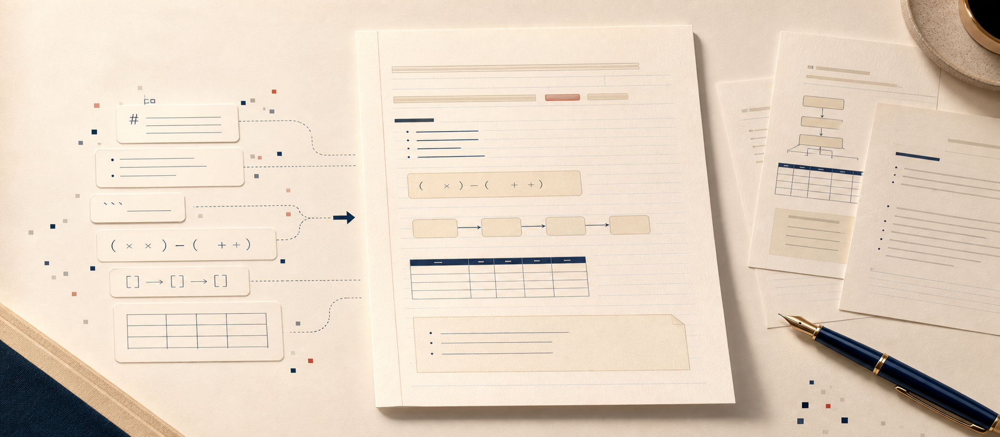

# 纸上成篇

> 把 Markdown 和纯文本，变成一页页能打印、能分享、能收藏的 A4 横线信纸。

<p align="center">
  
  <br>
  <sub><a href="assets/preview/page-01.png">查看完整 A4 预览图</a></sub>
</p>

<p align="center">
  <a href="#快速开始"></a>
  <a href="#导出-png"></a>
  <a href="#语义组件"></a>
  
</p>

<p align="center">
  <b>不是把文字塞进网页。</b><br>
  这是一个面向 Codex 的排版 Skill：真实 DOM 分页、A4 纸张比例、横线基线对齐、手写质感、结构化语义组件、逐页 PNG 导出，一次打通。
</p>

---

## 为什么它值得 Star

大多数 Markdown 渲染器负责「显示」。  
**纸上成篇负责「成稿」。**

它会把一段普通文本变成像认真写在纸上的页面：标题、作者、日期、正文、表格、公式、流程、指标、问题清单和落款都落在同一套横线网格里。你得到的不是截图味很重的网页，而是一组可以打印、发朋友圈、做长图、放进知识库的纸面作品。

## 适合做什么

- 把文章、笔记、复盘、读书摘录排成 A4 信纸
- 把 Markdown 文档导出为多页 PNG 长图素材
- 把结构化内容渲染成公式、流程、映射、指标、对比等纸面组件
- 给知识库、公众号、小红书、课程材料制作统一视觉风格
- 在 Codex 工作流中，把「内容生成」直接接到「可视化交付」

## 核心特性

| 能力 | 说明 |
| --- | --- |
| A4 信纸排版 | 固定 210mm x 297mm 页面，适合打印和图像导出 |
| 横线基线对齐 | 正文、标题、表格、组件都尽量回到统一 `--line` 网格 |
| 真实 DOM 分页 | 根据浏览器中的真实高度分页，不靠字数猜测 |
| Markdown 语义保留 | 支持标题、段落、列表、引用、表格、加粗、代码围栏 |
| 语义组件识别 | 公式、流程、映射、对比、指标、结果、问题清单自动分流 |
| 手写纸感 | 弱化元信息、轻微墨迹质感、克制装饰，不喧宾夺主 |
| 逐页 PNG 导出 | 使用 Chrome/Edge/Chromium 裁切每个 `.page` 为独立图片 |
| 跨平台脚本 | Windows、macOS、Linux 均可通过 Node.js 脚本导出 |

## 快速开始

### 作为 Codex Skill 使用

把仓库放到你的 Codex skills 目录中：

```bash
git clone <your-repo-url> ~/.codex/skills/paper-to-pages
```

Windows PowerShell：

```powershell
git clone <your-repo-url> "$env:USERPROFILE\.codex\skills\paper-to-pages"
```

然后在 Codex 中这样说：

```text
使用 $paper-to-pages 将这篇 Markdown 转成 A4 横线信纸 HTML，并导出每一页 PNG。
```

### 只使用导出脚本

如果你已经有符合结构的 HTML，可以直接导出图片：

```bash
node scripts/export_pages.mjs \
  --html ./letter-paper.html \
  --out ./pages \
  --clean
```

Windows PowerShell：

```powershell
node .\scripts\export_pages.mjs `
  --html ".\letter-paper.html" `
  --out ".\pages" `
  --clean
```

导出结果类似：

```text
pages/page-01.png
pages/page-02.png
pages/page-03.png
```

## 语义组件

当 Markdown 代码围栏里放的不是代码，而是结构化表达，纸上成篇会优先把它变成纸面组件。

```text
EPV = (T_s x F x P) - (C_l + C_c + C_m)
```

会更适合变成公式块，而不是灰扑扑的代码块。

```text
收简历
↓
筛选简历
↓
安排面试
```

会更适合变成流程块，而不是普通段落。

支持的核心组件：

- `.math-block`：公式和变量说明
- `.flow-block`：纵向流程
- `.map-block`：左右映射
- `.compare-block`：双项对比
- `.metric-block`：指标和值
- `.result-block`：结果胶囊
- `.question-block`：问题清单
- `.note-block`：短文本组
- `.code-block`：真实代码或命令

更多组件规范见 [references/semantic-components.md](references/semantic-components.md)。

## 项目结构

```text
paper-to-pages/
├─ SKILL.md                         # Skill 主说明和排版工作流
├─ agents/
│  └─ openai.yaml                   # Codex 展示名称与默认提示
├─ assets/
│  ├─ showcase.html                 # 视觉组件精灵图
│  └─ preview/page-01.png           # README 预览图
├─ references/
│  └─ semantic-components.md        # 语义组件识别与渲染规范
└─ scripts/
   └─ export_pages.mjs              # HTML 逐页导出 PNG
```

## 导出 PNG

`scripts/export_pages.mjs` 会启动本机 Chrome、Chromium 或 Microsoft Edge，通过浏览器调试协议裁切页面。

常用参数：

| 参数 | 作用 |
| --- | --- |
| `--html <file>` | 要导出的 HTML 文件 |
| `--out <dir>` | 输出目录，默认是 HTML 同级 `pages` |
| `--clean` | 导出前删除旧的 `page-*.png` |
| `--chrome <path>` | 手动指定浏览器可执行文件 |
| `--selector <css>` | 页面选择器，默认 `.page:not(.measure)` |
| `--wait <ms>` | 截图前等待时间，默认 `1200` |
| `--width` / `--height` / `--scale` | 控制视口和输出清晰度 |

需要：

- Node.js 22+
- Chrome、Chromium 或 Microsoft Edge

如果脚本找不到浏览器，可以这样指定：

```bash
node scripts/export_pages.mjs \
  --html ./letter-paper.html \
  --chrome "/Applications/Google Chrome.app/Contents/MacOS/Google Chrome"
```

或设置环境变量：

```bash
export CHROME_PATH="/path/to/chrome"
```

## 设计原则

- **纸面优先**：页面像纸，不像后台系统，也不像普通网页截图。
- **语义优先**：公式就是公式，流程就是流程，指标就是指标。
- **真实分页**：用 DOM 高度决定分页，不用字数粗暴估算。
- **克制美学**：装饰服务阅读，不抢正文和结论。
- **可交付**：最终产物必须能导出、能检查、能继续使用。

## 路线图

- [ ] 增加更多成品模板示例
- [ ] 增加常见 Markdown 输入样例
- [ ] 增加 PDF 导出工作流
- [ ] 增加自动视觉回归检查
- [ ] 增加更多中英文混排字体策略

## 贡献

欢迎提交 PR，尤其是这些方向：

- 更稳定的分页策略
- 更漂亮但仍克制的纸面组件
- 更多真实内容场景的样例
- 跨平台导出兼容性改进
- 中文、英文、中英混排的排版优化

提交前建议先检查：

```bash
node scripts/export_pages.mjs --html assets/showcase.html --out assets/preview --clean
```

确认导出的页面没有裁切、重叠、Markdown 标记泄漏或横线错位。

## License

本项目采用 MIT 许可证开源，详情见 [LICENSE](LICENSE)。

---

<p align="center">
  <b>让文字落到纸上，才算真正完成。</b>
</p>
